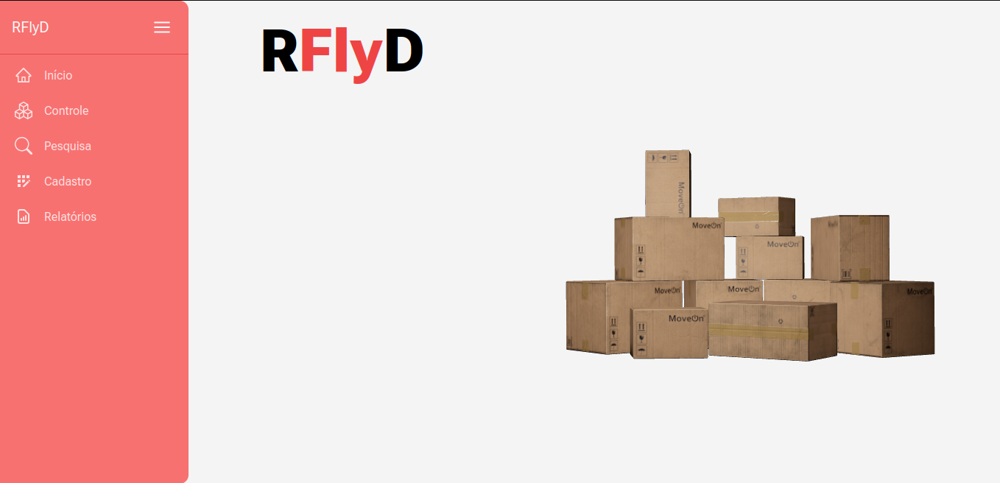
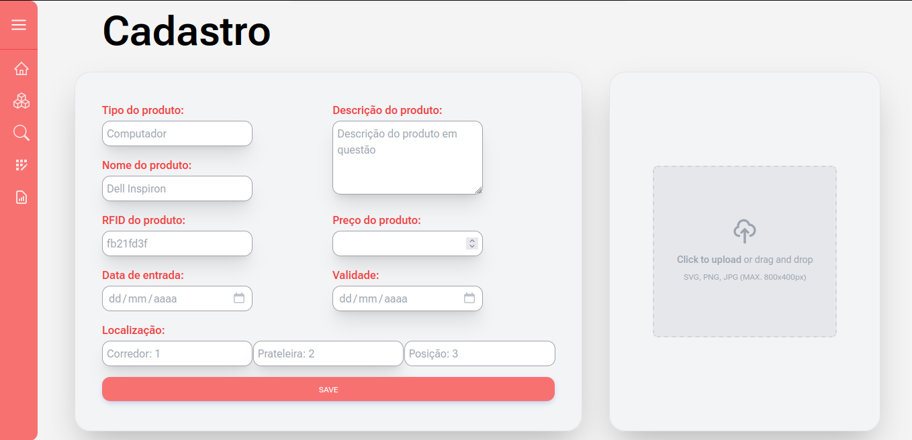
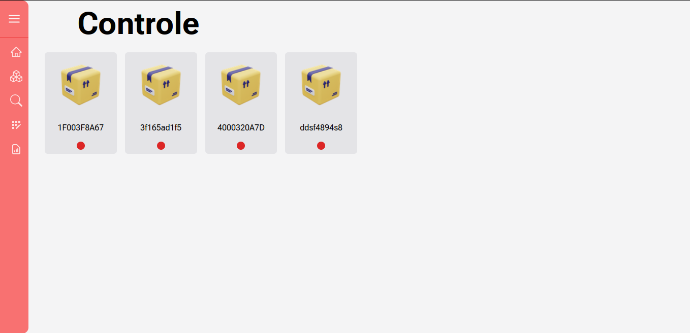
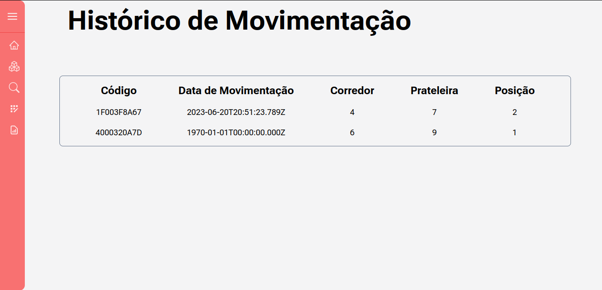
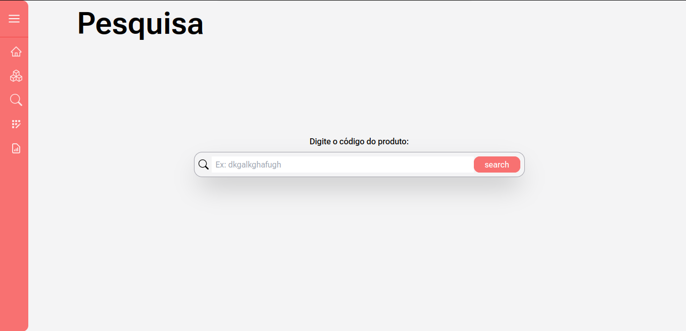
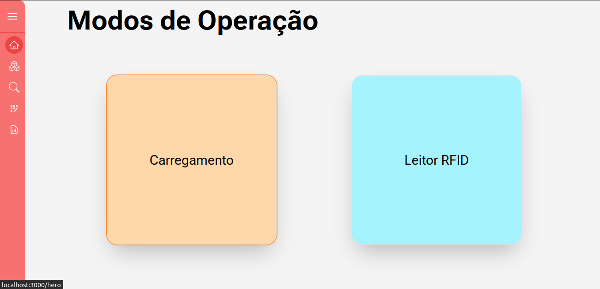

# SITE
Criado com o intuito de visualizar e interagir com os dados coletados a partir do leitor RFID.

# Instalação
Primeiramente, certifique-se que tenha o npm (node package manager) instalado na sua máquina. 

Caso não tenha clique [aqui](https://www.treinaweb.com.br/blog/o-que-e-npm-e-como-usar-uma-biblioteca-instalada-por-ele) e siga os passos.

Agora basta instalar as dependências, para isso esteja no diretório do projeto que contém o package.json e rode:
```
npm install
```

# Interface Web
## Rodando frontend
Depois de instalar as dependências necessárias, basta executar:
```
npm run dev
```
E acessar http://localhost:3000
## Tecnologias Utilizadas
As principais bibliotecas e frameworks utilizados foram:
- React
  - Biblioteca JavaScript para construir  elementos que os usuários veem e interagem na tela.
- Next.js
  - Framework que fornece blocos de construção para criar aplicativos da Web.
- Tailwindcss
  - Framework que fornece componentes para estilização.
  - Verifica todos os seus arquivos HTML, componentes JavaScript, gera os estilos correspondentes e, em seguida, grava em um arquivo CSS estático.
- Axios
  - Cliente HTTP.
  - No lado do servidor usa o código nativo do node.js, módulo http, enquanto no lado do cliente (navegador) usa XMLHttpRequests.

## Páginas do Site







# Backend
## Rodando backend
Depois de instalar as dependências necessárias, basta executar:
```
npm run dev
```
## Tecnologias Utilizadas
Foram utilizadas as seguintes frameworks e bibliotecas:
- Fastify
  -  Fornece recursos mínimos para construção de servidores web com foco em performance e baixo overhead.

- Axios
  - Cliente HTTP.
  - No lado do servidor usa o código nativo do node.js, módulo http, enquanto no lado do cliente (navegador) usa XMLHttpRequests.

- Zod 
  - Biblioteca de validação.
  - Possibilita definir uma estrutura com todos os valores que deseja validar e os seus respectivos tipos.

- Prisma
  - Prisma é um ORM de última geração. 
  - O schema.prisma permite que sejam definidos modelos para sua aplicação em uma linguagem de modelagem de dados intuitiva.
  - Ele também contém a conexão com um banco de dados.